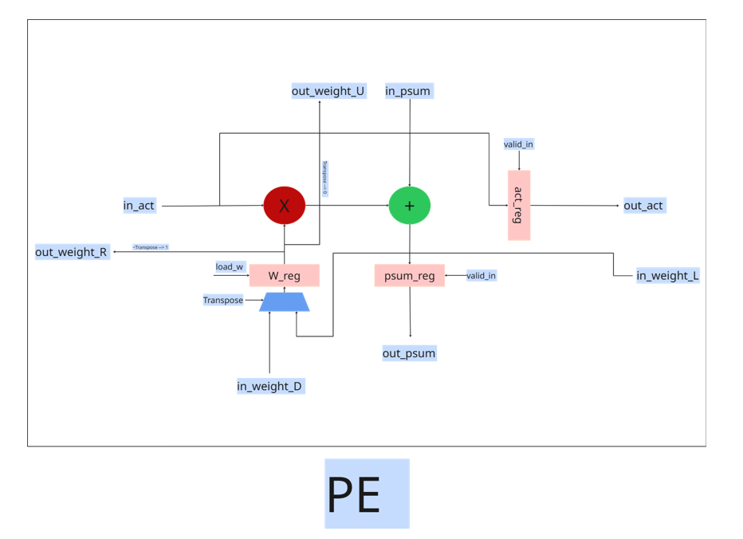
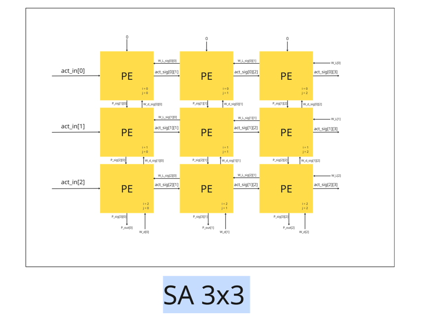
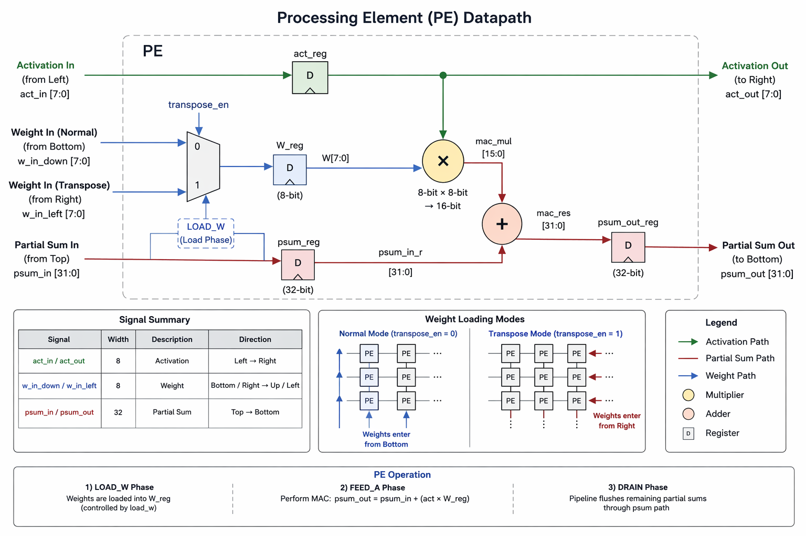
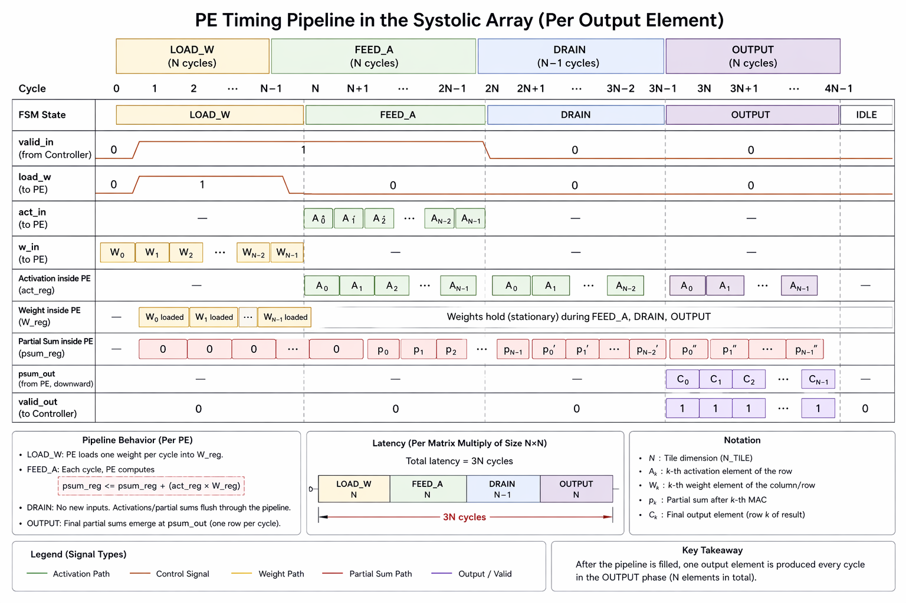
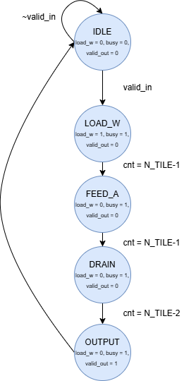

<div align="center">

# LEGO SA — Reconfigurable Systolic Array

### *Hardware Accelerator for MobileViT Vision Transformers*

[](.)
[](.)
[](.)
[](.)
[](LICENSE)

> **25× less power than GPU** | **−89.7% cycles vs fixed SA** | **2.02 ms MobileViT-xxs inference**

</div>

---

## 📖 Overview

**LEGO SA** is a reconfigurable systolic array accelerator designed to efficiently execute all matrix shapes found in hybrid CNN + Transformer models (MobileViT). Instead of a rigid fixed-size array, LEGO SA snaps together four **16×16 PE tiles** like building blocks into three distinct shapes — maximising utilisation and minimising memory traffic for every operation type.

A conventional 32×32 systolic array achieves only **50% PE utilisation** when computing `q·kᵀ` in multi-head attention. LEGO SA eliminates this inefficiency by dynamically switching tile configurations, achieving **up to 100% utilisation** across self-attention, MLP layers, and convolutions.

> Based on: *"Hardware Accelerator for MobileViT Vision Transformer with Reconfigurable Computation"* — **ISCAS 2024**

---

## ✨ Key Features

| Feature | Detail |
|---|---|
| **Reconfigurable shapes** | 3 tile configurations (Wide / Square / Tall) |
| **Total PEs** | 4 × 16×16 = **1,024 MAC units** |
| **Data formats** | INT8 activations & weights, INT32 accumulators |
| **Transpose weight loading** | Eliminates matrix transpose memory overhead (−85.8% cycles) |
| **Stall support** | LOAD_W and FEED_A phases cleanly stall on `valid_in=0` |
| **4:2 Compressor tree** | Hardware-efficient 4-way partial sum reduction for TYPE 2 |
| **Fully parameterized design** | Tile size, data width, and accumulator width configurable at compile time |

## ⚙️ Parameterization

The LEGO SA architecture is **fully parameterized**, allowing easy scaling of the systolic array tile size and data precision without modifying the RTL structure.

Key parameters control:

- Processing element precision
- Accumulator precision
- Tile dimension (NxN PEs per tile)
- Input/output bus widths

This enables rapid exploration of **performance, area, and power trade-offs** for different accelerator configurations.

### Supported Scaling

| Parameter | Description | Example |
|---|---|---|
| `DATA_W` | Activation / weight precision | 8-bit INT |
| `DATA_W_OUT` | Accumulator precision | 32-bit |
| `N_TILE` | Tile dimension (N×N PEs per tile) | 16 |

Example configurations:

| Configuration | PEs per Tile | Total PEs |
|---|---|---|
| `N_TILE = 8` | 64 | 256 |
| `N_TILE = 16` | 256 | **1,024 (default)** |
| `N_TILE = 32` | 1,024 | 4,096 |

## 🔩 Processing Element (PE)

The **Processing Element (PE)** is the fundamental compute unit of the LEGO SA architecture.  
Each PE performs one **multiply–accumulate (MAC)** operation per cycle while holding a **stationary weight**. The array follows a **weight-stationary systolic dataflow**, where weights remain inside the PE and activations stream across the array.




### PE Dataflow

Each PE participates in three independent data paths inside the systolic mesh.

| Data | Direction | Description |
|-----|-----------|-------------|
| **Activation (`act`)** | Left → Right | Activations propagate across rows |
| **Partial Sum (`psum`)** | Top → Bottom | Accumulated results flow down columns |
| **Weight (`W`)** | Bottom → Up or Right → Left | Loaded during `LOAD_W` phase |

This structure enables **fully pipelined matrix multiplication**.

Data precision:

| Signal | Bit-width |
|------|------|
| Activation | INT8 |
| Weight | INT8 |
| Accumulator | INT32 |


### Weight Loading Modes

The PE supports **two weight-loading directions** to enable efficient matrix transpose operations.

| Mode | `transpose_en` | Load Source | Propagation |
|-----|-----|-----|-----|
| Normal | `0` | Bottom boundary | Upward through the column |
| Transpose | `1` | Right boundary | Leftward through the row |

Both modes produce **identical PE weight registers** after `N_TILE` load cycles.

This mechanism removes the need for explicit matrix transpose in memory during attention computation.

### Internal Registers

| Register | Width | Purpose |
|--------|------|---------|
| `W_reg` | 8-bit | Stored stationary weight |
| `act_reg` | 8-bit | Activation pipeline register |
| `psum_reg` | 32-bit | Partial sum accumulator |


### PE Operation Phases

| Phase | Description |
|------|-------------|
| **LOAD_W** | Load weights into `W_reg` |
| **FEED_A** | Perform MAC operations |
| **DRAIN** | Flush remaining partial sums through the pipeline |





---

## 📐 Shape Types

The `lego_type` input reconfigures how the four tiles collaborate — **no PE hardware changes**, only routing.


### TYPE 0 — Wide `(16 × 64)`
```
lego_type = 2'b00   │   A(16×16) × W(16×64) → C(16×64)

         ┌────────┬────────┐
         │   RU   │   LU   │   ← Same activation row broadcast to ALL tiles
         │ W[0:15]│W[16:31]│     Each tile holds a different 16-column weight block
         ├────────┼────────┤
         │   RD   │   LD   │
         │W[32:47]│W[48:63]│
         └────────┴────────┘
Output: psum_out = { RU | LU | RD | LD }  — 64 values

```


> 🎯 Best for: `q·kᵀ` in MobileViT Block 1 — **100% PE utilisation**

---

### TYPE 1 — Square `(32 × 32)`
```
lego_type = 2'b01   │   A(16×32) × W(32×32) → C(16×32)

         ┌────────┬────────┐
         │   RU   │   LU   │   ← Top activation half [0:N-1]
         │W rows  │W rows  │
         │ [0:15] │ [0:15] │
         ├────────┼────────┤
         │   RD   │   LD   │   ← Bottom activation half [N:2N-1]
         │W rows  │W rows  │
         │[16:31] │[16:31] │
         └────────┴────────┘
Output: psum[0:N-1] = RU+RD  │  psum[N:2N-1] = LU+LD  — 32 values
```


> 🎯 Best for: MLP layers, pointwise convolution, square weight blocks

---

### TYPE 2 — Tall `(64 × 16)`
```
lego_type = 2'b10   │   A(16×64) × W(64×16) → C(16×16)

         ┌────────┬────────┐
         │   RU   │   LU   │   ← 4 INDEPENDENT activation slices
         │W rows  │W rows  │     4 INDEPENDENT weight row groups
         │ [0:15] │[32:47] │     All partial sums element-wise SUMMED
         ├────────┼────────┤
         │   RD   │   LD   │
         │W rows  │W rows  │
         │[16:31] │[48:63] │
         └────────┴────────┘
Output: psum[0:N-1] = RU + RD + LU + LD  — 16 values
```


> 🎯 Best for: `A·v` in attention, depth-wise conv — **>60% less memory access vs TYPE 1**

---
## 🕒Lego SA Timming





---

### Shape Selection Guide

| Operation | Shape | `lego_type` | PE Util. |
|---|---|:---:|:---:|
| MHA `q·kᵀ` (MVB1) | 16×256 | `0` (wide) | **100%** |
| MHA `A·v` (MVB1) | 256×16 | `2` (tall) | **100%** |
| MLP / Linear layers | 32×32 | `1` (square) | ~100% |
| Standard CONV | varies | `2` (tall) | high |
| Depth-wise CONV | varies | `2` (tall) | high |
| Pointwise CONV | varies | `1` (square) | high |

---

## 🏗️ Module Hierarchy

```
Lego_SA                     ← Top-level: routing, tile instantiation, output mux
├── Lego_CU                 ← Shared FSM: drives load_w, valid_out, busy
└── L_SA_NxN_top  × 4      ← Tile wrapper (RU, LU, RD, LD) — pure datapath
    ├── TRSRL               ← Triangular shift: skews activation rows (k-cycle delay on lane k)
    ├── SA_NxN              ← N×N mesh of PE instances
    │   └── PE  × N²        ← Weight-stationary MAC cell (8-bit × 8-bit → 32-bit)
    └── TRSDL               ← Triangular shift: de-skews partial sum columns
```

### Module Descriptions

| Module | File | Role |
|---|---|---|
| `Lego_SA` | `Lego_SA.sv` | Top level — routing, mux, tile fan-out |
| `Lego_CU` | `Lego_CU.sv` | Single shared FSM for all 4 tiles |
| `L_SA_NxN_top` | `L_SA_NxN_top.sv` | Tile wrapper — datapath only, no FSM |
| `SA_NxN` | `SA_NxN.sv` | N×N PE mesh |
| `PE` | `PE.sv` | Weight-stationary MAC cell |
| `TRSRL` | `TRSRL.sv` | Input activation diagonal skew |
| `TRSDL` | `TRSDL.sv` | Output partial-sum de-skew / alignment |
| `Compressor_42` | `Compressor_42.sv` | 4:2 carry-save compressor for TYPE 2 sum |

---

## ⚙️ Operation Protocol

Every matrix multiply follows the same **5-state FSM** sequence:

```
State:    IDLE  →  LOAD_W  →  FEED_A  →  DRAIN  →  OUTPUT
           │          │           │          │          │
Cycles:    —       N_TILE      N_TILE     N-1 auto   N auto
valid_in:  —        stall       stall        0          0
load_w:    0          1           0           0          0
valid_out: 0          0           0           0          1
```

### Step-by-Step

1. **Start tick** — Assert `valid_in=1`. FSM transitions `IDLE → LOAD_W`.
2. **LOAD_W** (N cycles) — Drive `weight_in` for N_TILE valid cycles. Stalls if `valid_in=0`.
3. **FEED_A** (N cycles) — Drive `act_in` for N_TILE valid cycles. Stalls if `valid_in=0`.
4. **DRAIN** (N−1 cycles, automatic) — Deassert `valid_in`. Pipeline drains through TRSDL.
5. **OUTPUT** (N cycles, automatic) — `valid_out=1`. Capture `psum_out` on every cycle.
6. **Idle** — Wait for `busy=0` before the next operation.

> ⚠️ **OUTPUT phase is not stall-able.** The consumer must be ready to read all N rows. Missed cycles cannot be recovered without re-running the matmul.

### Latency Formula
```
Total latency = 1 (start) + N (LOAD_W) + N (FEED_A) + (N−1) (DRAIN) = 3N cycles
             = 48 cycles at N_TILE = 16
```

---

## 🔌 Interface

```systemverilog
module Lego_SA #(
    parameter DATA_W     = 8,   // Activation / weight bit-width
    parameter DATA_W_OUT = 32,  // Accumulator bit-width
    parameter N_TILE     = 16   // Tile dimension (N×N PEs per tile)
)(
    input  logic                  clk, rst_n,
    input  logic                  valid_in,       // Start / data-valid
    input  logic [1:0]            lego_type,      // 0=wide, 1=square, 2=tall
    input  logic                  transpose_en,   // 0=load from bottom, 1=from right
    input  logic [DATA_W-1:0]     act_in    [4*N_TILE],
    input  logic [DATA_W-1:0]     weight_in [4*N_TILE],
    output logic [DATA_W_OUT-1:0] psum_out  [4*N_TILE],
    output logic                  valid_out,
    output logic                  busy
);
```

---

## 🔄 Transpose Weight Loading

Both modes produce **identical PE register state** after N_TILE load cycles — same output matrix `C = A × W`. The difference is the physical load direction:

| Mode | `transpose_en` | Entry point | Direction | Tick k drives |
|---|:---:|---|---|---|
| Normal | `0` | Bottom boundary | Upward | Row `k` of W |
| Transpose | `1` | Right boundary | Leftward | Column `k` of W |

> 💡 Transpose mode enables efficient attention score transposition with **no extra memory allocation**. This achieves an **85.8% reduction** in matrix transpose execution cycles.

---

## 🔀 Convolution Mapping

Convolutions are converted into matrix multiplication form. A convolution with `ICP` input channels, filter kernel size `KWP`, and `OCP` output channels maps to a weight matrix of size `(ICP×KWP) × OCP`.

LEGO SA selects different **hardware parallelism** schemes per operation to maximise PE utilisation and minimise memory access:

| Parallelism | Symbol | Description |
|---|:---:|---|
| Input Channel Parallelism | **ICP** | Process multiple input channels simultaneously |
| Output Channel Parallelism | **OCP** | Produce multiple output channels per cycle |
| Kernel Window Parallelism | **KWP** | Unroll filter kernel positions across PEs |
| Output Row Parallelism | **ORP** | Process multiple output rows in parallel |

### SA Type & Parallelism per Operation

| Operation | LEGO SA Type | ICP | KWP | ORP | OCP |
|---|:---:|:---:|:---:|:---:|:---:|
| MHA (self-attention) | Type-0, 1, 2 | — | — | — | — |
| MLP | Type-1 | — | — | — | — |
| Standard CONV | Type-2 | 7 | 9 | 1 | 16 |
| Depth-wise CONV (DWC) | Type-2 | 1 | 9 | 16 | 1 |
| Pointwise CONV (PWC) | Type-1 | 64 | 1 | 1 | 16 |

> 💡 A **CONV Converter** generates duplicated input data on-chip, avoiding redundant external memory reads and reducing memory access power.

---

## 📦 Repository Structure

```
Lego-Systolic-Array/
│   README.md
│
├── Diagrams/
│   ├── PE.PNG              ← Processing element internals
│   ├── SA_16x16.PNG        ← Full 16×16 systolic array structure
│   ├── SA_3x3.PNG          ← Simplified 3×3 example for clarity
│   └── TRSRL.PNG           ← Triangular shift register layout
│
├── RTL/
│   ├── Lego SA/            ← LEGO SA reconfigurable accelerator
│   │   ├── Compressor_42.sv
│   │   ├── Lego_CU.sv
│   │   ├── Lego_SA.sv
│   │   ├── L_SA_NxN_top.sv
│   │   ├── PE.sv
│   │   ├── SA_NxN.sv
│   │   ├── TRSDL.sv
│   │   └── TRSRL.sv
│   │
│   └── SA NxN/             ← Standalone NxN systolic array baseline
│       ├── PE.sv
│       ├── SA_CU.sv
│       ├── SA_NxN.sv
│       ├── SA_NxN_top.sv
│       ├── TRSDL.sv
│       └── TRSRL.sv
│
└── TB/
    ├── Lego SA/            ← LEGO SA testbenches (5,010 tests)
    │   ├── Lego_SA_tb.sv
    │   ├── PE_tb.sv
    │   ├── TRSDL_tb.sv
    │   └── TRSRL_tb.sv
    │
    └── SA NxN/             ← Baseline SA testbenches
        ├── PE_tb.sv
        ├── SA_NxN_top_tb.sv
        ├── TRSDL_tb.sv
        └── TRSRL_tb.sv
```

---

## 🧪 Running the Testbench

The `Lego_SA_tb.sv` testbench includes **10 directed test cases** (TC1–TC10) covering all shape types in both normal and transpose modes, plus **5,000 random tests** with prime-modulus unique values for maximum fault coverage.

```bash
# Compile and simulate with Icarus Verilog
iverilog -g2012 -o lego_tb \
    TB/Lego\ SA/Lego_SA_tb.sv \
    RTL/Lego\ SA/Lego_SA.sv   \
    RTL/Lego\ SA/Lego_CU.sv   \
    RTL/Lego\ SA/L_SA_NxN_top.sv \
    RTL/Lego\ SA/SA_NxN.sv    \
    RTL/Lego\ SA/PE.sv         \
    RTL/Lego\ SA/TRSRL.sv      \
    RTL/Lego\ SA/TRSDL.sv

vvp lego_tb

# With a custom random seed
vvp lego_tb +SEED=12345
```

**Expected result:** `ALL TESTS PASSED (5010/5010)`

---

## ⚠️ Common Pitfalls

| Mistake | Fix |
|---|---|
| TYPE 2 weight slot confusion | Bus `[N:2N-1]` → **LU tile**. Bus `[2N:3N-1]` → **RD tile**. W rows `2N..3N-1` go in slot 1, not slot 2. |
| Missing start tick | The first `valid_in=1` moves `IDLE→LOAD_W`. `load_w` is still `0` on that tick. First weight latch is on the **second** valid cycle. |
| Reading OUTPUT too early | Do not read `psum_out` until `valid_out=1`. The DRAIN phase must complete first. |
| Missing OUTPUT cycles | `valid_out=1` for exactly N_TILE cycles. All N rows must be captured — no partial reads. |
| New matmul while busy | Always wait for `busy=0` before asserting `valid_in=1` for the next operation. |
| Transpose changes act packing | `transpose_en` only affects weight loading direction. `act_in` bus packing is **identical** in both modes. |

---

## 📊 Performance Results

### Cycle Count vs. Fixed 32×32 SA

| Operation | 32×32 SA | LEGO SA | Improvement |
|---|---:|---:|:---:|
| MVB1 MHA (`q·kᵀ`) | 229,888 | 141,312 | **−38.5%** |
| Depth-wise CONV | 3,151,872 | 324,864 | **−89.7%** |
| Standard CONV | 171,664 | 190,736 | +11.1% *(but >60% less memory)* |
| Matrix Transpose | 92,160 + 4,864 | 8,960 + 4,864 | **−85.8%** |

---

## 📜 License

This project is licensed under the **MIT License**.

See the [LICENSE](LICENSE) file for full details.

---

## 📚 Reference

```bibtex
@inproceedings{hsiao2024legosa,
  author    = {Shen-Fu Hsiao and Tzu-Hsien Chao and Yen-Che Yuan and Kun-Chih Chen},
  title     = {Hardware Accelerator for {MobileViT} Vision Transformer
               with Reconfigurable Computation},
  booktitle = {2024 IEEE International Symposium on Circuits and Systems (ISCAS)},
  year      = {2024},
  doi       = {10.1109/ISCAS58744.2024.10558190}
}
```
---
<div align="center">

*Built in SystemVerilog · 1,024 PEs · 1.2 TOPS*

</div>
